# CurbIt

CurbIt is an iOS application designed to track impulse purchase resistance and convert daily financial discipline into progress toward personal savings goals. When a user resists spending money on an impulse purchase, CurbIt records the item and allocates the saved amount directly to a targeted goal.

## Requirements

| Requirement | Minimum Version | Notes |
| :--- | :--- | :--- |
| Xcode | Xcode 16.0+ | Required for compilation and App Intents framework support |
| iOS Target | iOS 18.0+ | Base application deployment target |
| Apple Intelligence | iOS 18.1+ | Required for on-device Foundation Models motivation features |

## Technologies Used

- **Swift**: Built using modern Swift syntax and structured async/await concurrency patterns.
- **UIKit**: Programmatic layout implementation utilizing view controller hierarchies, inset-grouped table views, sheet presentation controllers, and dynamic theme adaptations.
- **SwiftUI Integration**: Embedded SwiftUI views and previews integrated directly into UIKit view controller layouts.
- **SwiftData**: Local data persistence using `@Model` classes (`Goal` and `Impulse`) with relationship cascading and context management via `ModelContainer`.
- **Apple Intelligence (Foundation Models)**: On-device text generation using system foundation models in `MotivationService` to generate custom, three-phase motivational milestone phrases based on goal titles.
- **App Intents**: System integrations providing `LogImpulseIntent` and `GoalEntity` queries for Siri, Shortcuts, and quick actions.
- **User Notifications**: Local notifications via `UNUserNotificationCenter` to alert users when a goal is completed through background intents.
- **Core Animation and Haptics**: Custom `CAEmitterLayer` confetti particle system (`ConfettiCannonView`) and haptic feedback generators (`UINotificationFeedbackGenerator`) for goal completion celebrations.

## Core Features

### Apple Intelligence Motivation Engine
When a goal is saved, CurbIt uses `MotivationService` to request three tailored motivational milestones from the on-device model:
1. **Starter Phase (0-30%)**: Initial encouragement for setting a new goal.
2. **Middle Phase (30-80%)**: Midpoint motivation to sustain saving progress.
3. **Endgame Phase (80-100%)**: Final push encouragement when approaching target completion.

If hardware capabilities or system locales do not support on-device generation, the app smoothly falls back to a curated pool of localized motivational statements.

### App Intents and Siri Integration
The `LogImpulseIntent` framework implementation enables users to log saved purchases via Siri or the Shortcuts application without manually opening the app interface. The intent accepts:
- Resisted item title.
- Saved dollar amount.
- Target goal selection with dynamic disambiguation prompts when multiple active goals exist.

### Goal Completion Celebrations
CurbIt handles goal completions depending on where the action originates:
- **In-App Completion**: Achieving a goal within the app triggers a `ConfettiCannonView` particle animation, success haptics, and card state transitions.
- **Intent Completion**: Logging an impulse via background intents triggers an immediate local iOS notification informing the user that their goal was completed.

## App Screens

### 1. Registration Screen
Displayed on initial application launch to capture user preferences. The screen allows users to input their name and select a preferred currency symbol (USD, EUR, GBP, ILS, AUD, CAD) stored in `AppPreferences`. Completing registration prompts for iOS notification permissions and presents the main dashboard.

| Light Mode | Dark Mode |
| :---: | :---: |
| 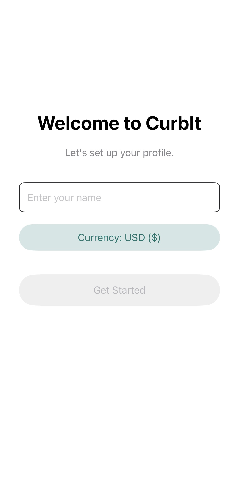 | 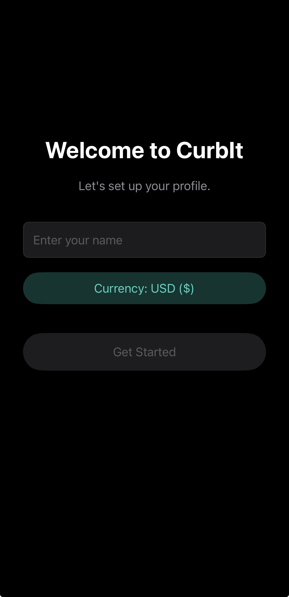 |

### 2. Home Dashboard Screen
The primary control screen displays a time-aware greeting, total cumulative savings across active goals, total count of completed goals, and a list of active and completed goal cards. Users can launch quick actions to record impulses or add new goals.

| Light Mode | Dark Mode |
| :---: | :---: |
| 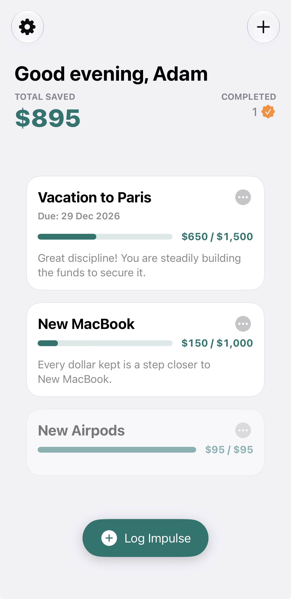 | 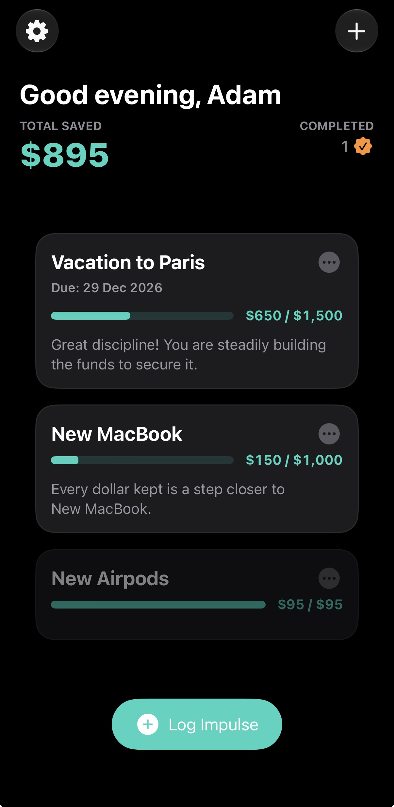 |

### 3. Goal Form Screen
A modal view controller used for creating or editing goals. Users specify the goal title, target dollar amount, and optional target date using a compact date picker. Saving triggers background generation of Apple Intelligence motivational quotes.

| Light Mode | Dark Mode |
| :---: | :---: |
| 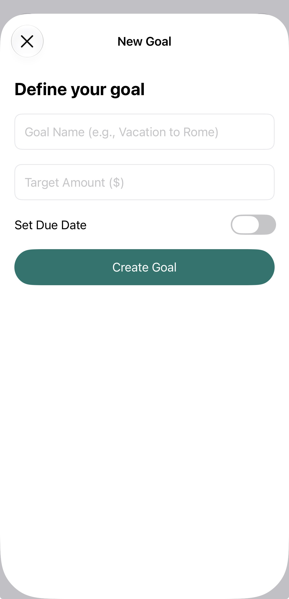 | 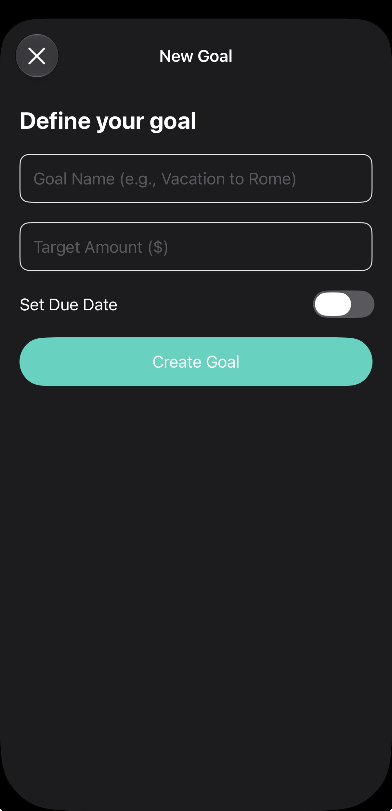 |

### 4. Impulse Form Screen
A presentation sheet to record a resisted purchase. Includes input fields for purchase name, saved numerical amount, and a goal selector menu to designate which active goal receives the savings.

| Light Mode | Dark Mode |
| :---: | :---: |
| 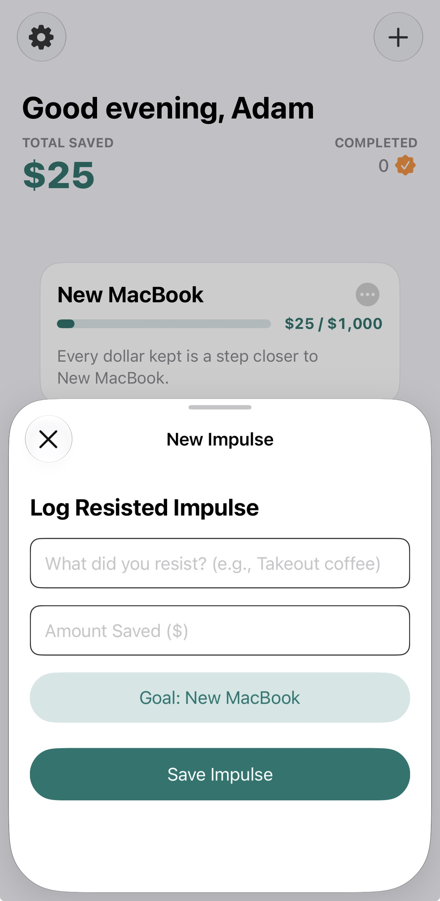 | 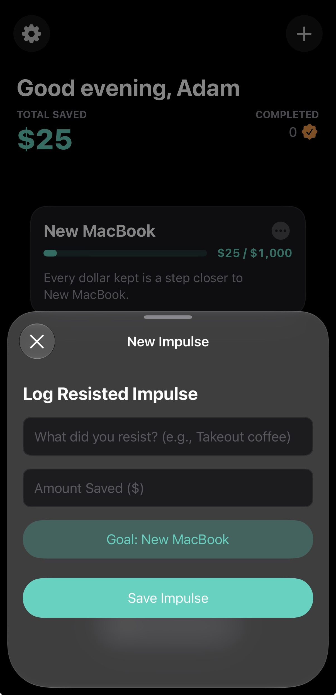 |

### 5. Goal Detail Screen
Presents progress and transaction history for an individual goal. Shows progress toward the target amount, active motivational text corresponding to completion percentage, and a table of recorded impulses with swipe-to-delete support.

| Light Mode | Dark Mode |
| :---: | :---: |
| 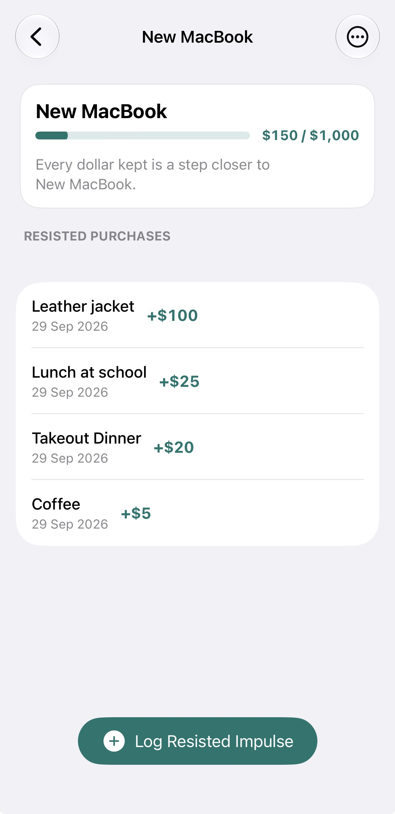 | 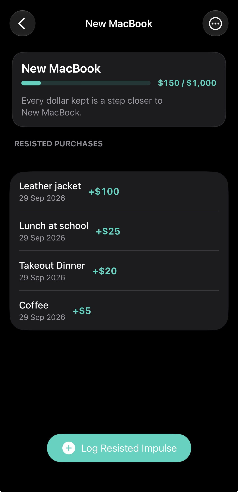 |

### 6. Settings Screen
Allows users to update their profile name and currency formatting choice. Displays a confirmation alert when changing currency symbols to clarify that visual formatting is updated without altering stored numerical values.

| Light Mode | Dark Mode |
| :---: | :---: |
| 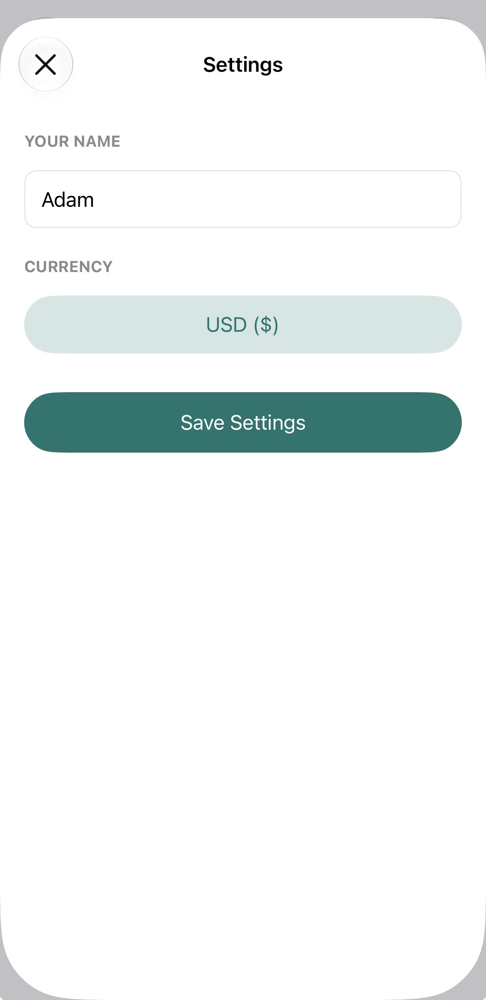 | 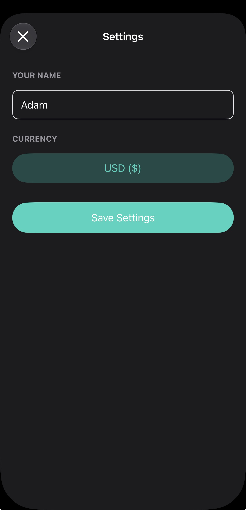 |
